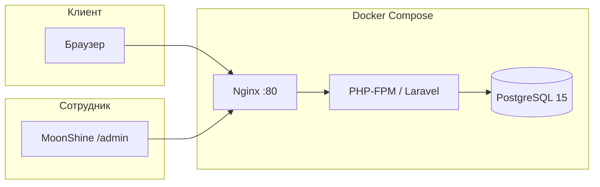
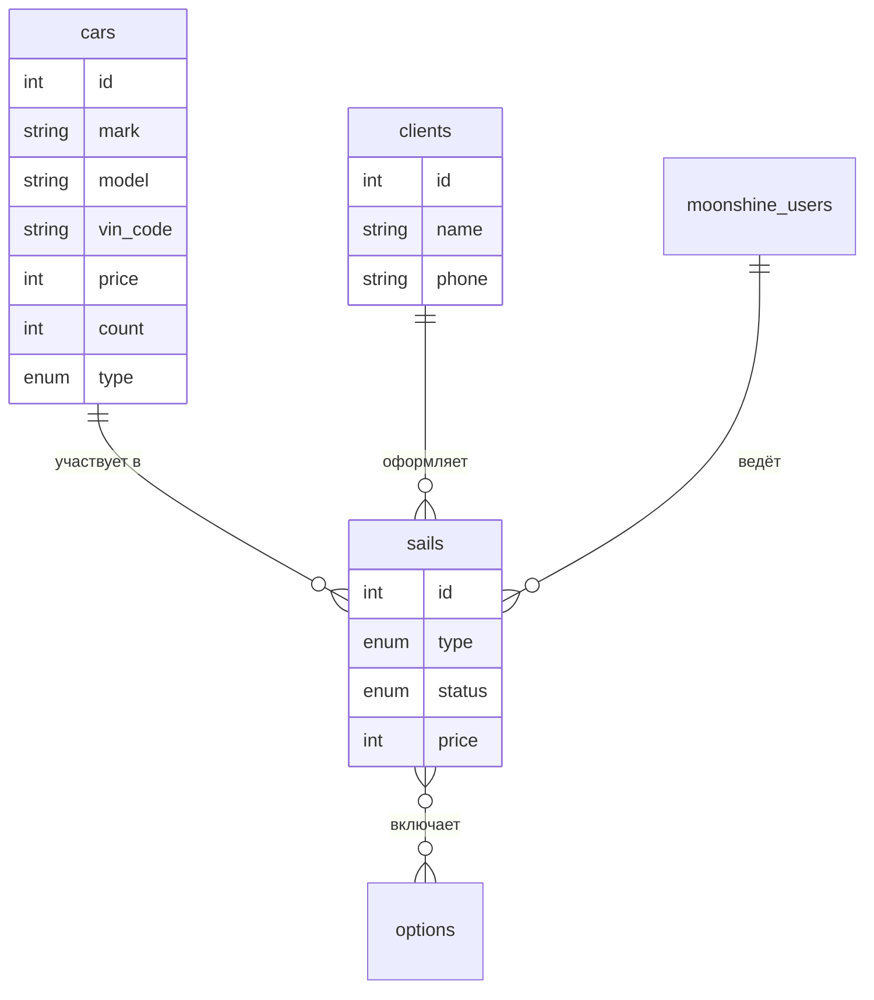

# DriveLine — информационная система автосалона

Курсовая работа: веб-приложение для учёта автомобилей, клиентов и сделок автосалона. Публичный каталог для посетителей и административная панель для сотрудников.

---

## О проекте

**DriveLine** — это full-stack веб-система, которая объединяет:

- **Витрину** — каталог новых и подержанных автомобилей с фильтрацией по типу, ценой, VIN, пробегом и фотографиями.
- **Бэк-офис** — управление складом, клиентами, сделками (покупка / продажа) и дополнительными опциями через админ-панель MoonShine.

При завершении сделки система автоматически списывает или возвращает автомобиль на склад, что отражает реальный бизнес-процесс автосалона.



---

## Основной функционал

| Модуль | Описание |
|--------|----------|
| **Каталог** | Публичная страница с вкладками «Новый» / «Б/У», карточками автомобилей и актуальным остатком на складе |
| **Автомобили** | Марка, модель, класс, VIN, год, цена, цвет, пробег, тип, количество, превью и галерея файлов |
| **Клиенты** | Учёт покупателей с контактными данными |
| **Сделки** | Покупка (приём авто на склад) и продажа (списание со склада) со статусами: подготовка, завершена, отменена |
| **Опции** | Дополнительные услуги, привязанные к сделкам |
| **Парсер** | Artisan-команда для наполнения каталога данными из внешнего API |

---

## Стек технологий

### Backend

| Технология | Версия / назначение |
|------------|---------------------|
| [PHP](https://www.php.net/) | 8.4+ (Docker-образ: 8.5) |
| [Laravel](https://laravel.com/) | 13 — фреймворк, маршрутизация, ORM, очереди |
| [MoonShine](https://moonshine-laravel.com/) | 4.11 — админ-панель и CRUD |
| PostgreSQL | 15 — основная СУБД в Docker |
| Eloquent ORM | Модели, связи, миграции, enum-касты |
| DTO + Services | `CreateCarDto`, `CarService`, `SailService` — бизнес-логика сделок |

### Frontend

| Технология | Назначение |
|------------|------------|
| [Blade](https://laravel.com/docs/blade) | Шаблоны публичной витрины |
| [Tailwind CSS](https://tailwindcss.com/) | 4 — стилизация каталога |
| [Vite](https://vitejs.dev/) | 8 — сборка CSS/JS |

### Инфраструктура и DevOps

| Технология | Назначение |
|------------|------------|
| [Docker Compose](compose.yml) | PHP-FPM, Nginx, PostgreSQL |
| [GitHub Actions](.github/workflows/) | Pint, PHPStan, PHPUnit, деплой по SSH |
| [Laravel Pint](https://laravel.com/docs/pint) | Форматирование кода |
| [PHPStan](https://phpstan.org/) + Larastan | Статический анализ |
| [PHPUnit](https://phpunit.de/) | Автотесты |

---

## Архитектура Docker

Проект поднимается тремя сервисами из [`compose.yml`](compose.yml):

| Сервис | Образ / сборка | Порт | Роль |
|--------|----------------|------|------|
| `app` | `_docker/Dockerfile` (PHP-FPM) | — | Laravel-приложение |
| `nginx` | `nginx:alpine` | **80** | Веб-сервер, `public/` |
| `database` | `postgres:15-alpine` | **15432** → 5432 | PostgreSQL, volume `pg-data` |

Сеть `laravel-network` связывает все контейнеры. Исходный код монтируется в `/var/www`.

---

## Быстрый старт

### Требования

- [Docker](https://www.docker.com/) и Docker Compose
- [Make](https://www.gnu.org/software/make/) (опционально, для удобных команд)

### 1. Клонирование и настройка окружения

```bash
git clone <url-репозитория> course_work
cd course_work
cp .env.example .env
```

Настройте подключение к PostgreSQL в `.env`:

```env
DB_CONNECTION=pgsql
DB_HOST=database
DB_PORT=5432
DB_DATABASE=driveline
DB_USERNAME=driveline
DB_PASSWORD=secret
```

Значения `DB_*` должны совпадать с переменными `POSTGRES_*` в `compose.yml`.

### 2. Запуск контейнеров

```bash
make up
```

Команда `make up` выполняет:

- сборку и запуск контейнеров;
- миграции БД (`php artisan migrate --force`);
- очистку кэша Laravel.

Приложение будет доступно по адресу: **http://localhost**

Админ-панель MoonShine: **http://localhost/admin** (логин создаётся при установке MoonShine).

### 3. Сборка фронтенда

```bash
docker compose exec app npm install
docker compose exec app npm run build
```

Для разработки с hot-reload:

```bash
docker compose exec app npm run dev
```

### 4. Наполнение каталога (опционально)

```bash
docker compose exec app php artisan app:car-parser
```

Команда загружает данные об автомобилях из внешнего API и создаёт записи в БД.

---

## Makefile

| Команда | Действие |
|---------|----------|
| `make up` | Запуск Docker + миграции + очистка кэша |
| `make down` | Остановка контейнеров |
| `make restart` | Перезапуск стека |
| `make migrate` | Запуск миграций |
| `make cache` | `php artisan optimize:clear` |
| `make test` | PHPUnit-тесты |
| `make pint` | Проверка стиля кода |
| `make phpstan` | Статический анализ |
| `make complex` | test + pint + phpstan |
| `make queue` | Обработчик очереди |

---

## Структура проекта

```
├── app/
│   ├── Console/Commands/     # Artisan-команды (парсер автомобилей)
│   ├── DTO/                    # Data Transfer Objects
│   ├── Enums/                  # CarType, CarColor, SailType, SailStatus
│   ├── Http/Controllers/       # Публичные контроллеры
│   ├── Models/                 # Car, Client, Sail, Option
│   ├── MoonShine/Resources/    # Ресурсы админ-панели
│   ├── Services/               # CarService, SailService
│   └── Traits/                 # Fileable, HasPreview
├── resources/pages/            # Blade-шаблоны витрины
├── database/migrations/        # Схема БД
├── _docker/                    # Dockerfile, конфиг Nginx
├── compose.yml                 # Docker Compose
└── .github/workflows/          # CI/CD
```

---

## Модель данных



---

## CI/CD

При каждом push и pull request запускается workflow [**Test**](.github/workflows/test.yml):

1. **Pint** — проверка стиля PHP-кода  
2. **PHPStan** — статический анализ  
3. **PHPUnit** — тесты на PostgreSQL  

После успешного прохождения тестов на ветке `main` / `master` срабатывает [**Deployment**](.github/workflows/deployment.yml) — деплой на сервер по SSH с миграциями и сборкой фронтенда.

---

## Разработка без Docker

```bash
composer install
cp .env.example .env
php artisan key:generate
php artisan migrate
npm install && npm run build
composer dev   # serve + queue + logs + vite
```

---
